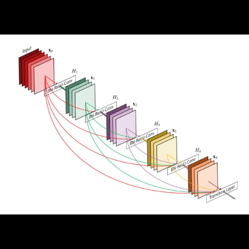

## Code

* [PyTorch: Training a Classifier](https://githubtocolab.com/dlmacedo/starter-academic/blob/master/content/courses/deeplearning/notebooks/pytorch/cifar10_tutorial.ipynb)

* [PyTorch: Transfer Learning Tutorial](https://githubtocolab.com/dlmacedo/starter-academic/blob/master/content/courses/deeplearning/notebooks/pytorch/transfer_learning_tutorial.ipynb)

* [PyTorch: Finetuning Torchvision Models](https://githubtocolab.com/dlmacedo/starter-academic/blob/master/content/courses/deeplearning/notebooks/pytorch/finetuning_torchvision_models_tutorial.ipynb)

* [TensorFlow Image classification](https://githubtocolab.com/dlmacedo/starter-academic/blob/master/content/courses/deeplearning/notebooks/tensorflow/classification.ipynb)

* [TensorFlow Hub with Keras](https://githubtocolab.com/dlmacedo/starter-academic/blob/master/content/courses/deeplearning/notebooks/tensorflow/hub_with_keras.ipynb)

## Slides

To be uploaded after presential lecture.
